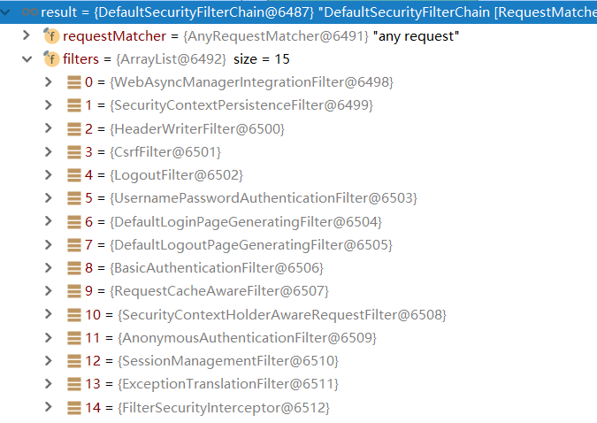
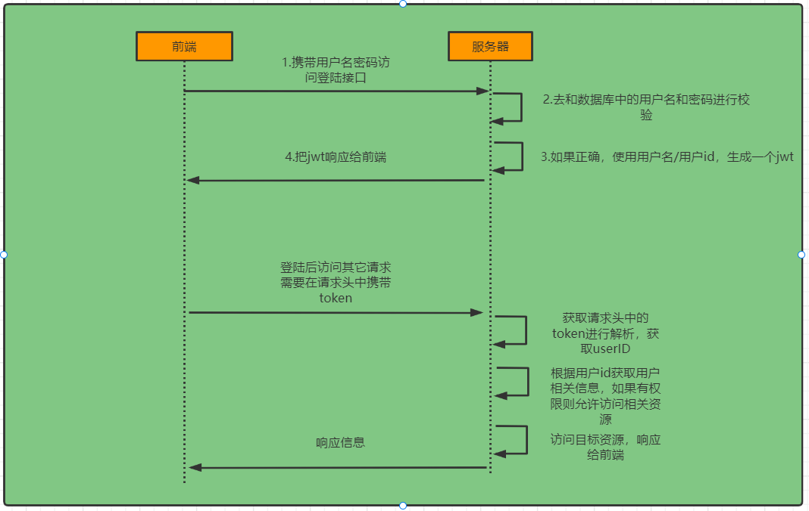

## 一、框架简介

### 1.1 概要

Spring 是非常流行和成功的 Java 应用开发框架，Spring Security 正是 Spring 家族中的成员。
Spring Security 基于 Spring 框架，提供了一套 Web 应用安全性的完整解决方案。

正如你可能知道的关于安全方面的两个主要区域是 **认证** 和 **授权**（或者访问控制），一般来说，Web 应用的安全性包括**用户认证（Authentication）和用户授权（Authorization）**两个部分，这两点也是 Spring Security 重要核心功能。

- **用户认证** 指的是：验证某个用户是否为系统中的合法主体，也就是说用户能否访问该系统。用户认证一般要求用户提供用户名和密码。系统通过校验用户名和密码来完成认证过程。**通俗点说就是系统认为用户是否能登录。**

- **用户授权** 指的是：验证某个用户是否有权限执行某个操作。在一个系统中，不同用户所具有的权限是不同的。比如对一个文件来说，有的用户只能进行读取，而有的用户可以进行修改。一般来说，系统会为不同的用户分配不同的角色，而每个角色则对应一系列的权限。**通俗点讲就是系统判断用户是否有权限去做某些事情。**


### 1.2 同款安全验证框架对比

> **SpringSecurity：** 

- 重量级框架

- 和 Spring 无缝整合。
- 全面的权限控制。
- 专门为 Web 开发而设计：
  - 旧版本不能脱离 Web 环境使用。
  - 新版本对整个框架进行了分层抽取，分成了核心模块和 Web 模块。单独引入核心模块就可以脱离 Web 环境。

> **Shiro：** 

- 轻量级框架。Shiro 主张的理念是把复杂的事情变简单。针对对性能有更高要求的互联网应用有更好表现。
- 通用性：
  - 好处：不局限于 web 环境
  - 不足：在 web 环境下一些特定的需求需要手动编写代码制定。

> **常见组合：** 

- SSM + Shiro
- SpringBoot / SpringCloud + Spring Security


## 二、快速开始

### 2.1 简单登录

**方案一：引入依赖即可**，尝试去访问接口就会自动跳转到一个SpringSecurity的默认登陆页面，默认用户名是*user*，程序启动后会生成 *随机密码* 并输出在控制台

```xml
<dependency>
    <groupId>org.springframework.boot</groupId>
    <artifactId>spring-boot-starter-security</artifactId>
</dependency>
```

**方案二：配置文件指定用户名与密码**

```yaml
Spring:
security:
 user:
   name: leo
   password: 123456
```

**方案三：结合项目使用数据库**（配置略，参考流程详解）


### 2.2 核心：

#### 2.2.1 配置类：

```java
@Configuration
@EnableWebSecurity //开启WebSecurity
public class SecurityConfig extends WebSecurityConfigurerAdapter {
    @Override
    protected void configure(HttpSecurity http) throws Exception {
        http.formLogin() // 开启自动配置的表单登录功能
            .and()
            .authorizeRequests() // 认证配置
            .anyRequest() // 其他任何请求
            .authenticated(); // 都需要身份验证
    }
}
```


#### 2.2.2 过滤器链：

> **SpringSecurity** 本质是一个过滤器链。其中最核心的 3 个过滤器如下图所示：


**UsernamePasswordAuthenticationFilter：**负责处理在登陆页面发送的 `/login`  `POST ` 登陆请求。

**ExceptionTranslationFilter：**异常过滤器，作用是处理过滤器链中抛出的任何AccessDeniedException 和 AuthenticationException。

**FilterSecurityInterceptor：**负责权限校验的过滤器，基本位于过滤链的最底部。

*我们可以通过Debug查看当前系统中SpringSecurity过滤器链中有哪些过滤器及它们的顺序。*




#### 2.2.3 重要接口 / 类：

**Authentication** 接口: 它的实现类，表示当前访问系统的用户，封装了用户相关信息；

**AuthenticationManager** 接口：定义了认证 *Authentication* 的方法；

**UserDetailsService **接口：加载用户特定数据的核心接口。定义一个方法 *loadUserByUsername()*，根据用户名获取用户信息并封装成 *UserDetails* 对象返回；

**UserDetails** 接口：提供核心用户信息。存储但不直接使用，用户信息会封装到 *Authentication* 对象中；

**PasswordEncoder** 接口：Spring Security 要求容器中必须有 *PasswordEncoder* 实例。所以当自定义登录逻辑时要求必须给容器注入 PaswordEncoder 的 bean 对象。

**BCryptPasswordEncoder** 是该接口的一个子类，它是官方推荐的密码解析器，BCryptPasswordEncoder 是对 bcrypt 强散列方法的具体实现，基于 Hash 算法实现的单向加密。可以通过 strength 控制加密强度，默认 10.


## 三、流程详解

**思路分析：**

> <b style="color:red">登录：</b> 
>
> ​	①自定义登录接口  
>
> ​				调用ProviderManager的方法进行认证 如果认证通过生成jwt
>
> ​				把用户信息存入redis中
>
> ​	②自定义UserDetailsService 
>
> ​				在这个实现类中去查询数据库
>
> <b style="color:red">校验：</b> 
>
> ​	①定义Jwt认证过滤器
>
> ​				获取token
>
> ​				解析token获取其中的userid
>
> ​				从redis中获取用户信息
>
> ​				存入SecurityContextHolder




### 3.1 认证

编写 **UserDetailServiceImpl** 类实现 **UserDetailService** 接口，重写 **loadUserByUsername** 方法并返回 **UserDetails** 对象


### 3.2 授权

#### 3.2.1 RBAC权限模型

> **RBAC（ Role-Based Access Control）**即**基于角色的访问控制模型，该模型的核心是所有访问都是通过「角色」进行的，所有「用户」都只能通过分配给他们的角色或通过角色层级结构继承的角色获得对应权限**。
>
> 与传统的 **ACL（Access Control List）**权限模型不同的是，ACL 是将权限直接授予给具体的用户，而 RBAC 则是分配给用户对应的角色，该用户就可以获得角色的所有权限，这样可以实现用户和权限的逻辑分离，极大程度上简化用户的权限管理。


#### 3.2.2 注解使用

> 使用注解前需要先在配置类上开启注解功能：**@EnableGlobalMethodSecurity(props...)**

| 注解               | 说明                                                 | 需要开启的 props 配置 |
| ------------------ | ---------------------------------------------------- | --------------------- |
| **@Secured**       | 进入方法前，<br>判断是否具有角色                     | securedEnabled = true |
| **@PreAuthorize**  | 进入方法前，<br>判断是否有具有角色/权限              | prePostEnabled = true |
| **@PostAuthorize** | 执行方法后，<br>进行权限验证。                       | 同上                  |
| **@PreFilter**     | 进入方法前，<br>进行权限验证，留下符合条件的方法参数 | /                     |
| **@PostFilter**    | 进入方法后，<br/>进行权限验证，留下符合条件的数据    | /                     |

> **实际应用：**

```java
@Secured({"ROLE_normal","ROLE_admin"}) //需要添加前缀“ROLE_“

@PreAuthorize("hasRole('ROLE_admin')")
@PreAuthorize("hasAnyAuthority('menu:system')")

@PreFilter(value = "filterObject.id%2==0")		 //过滤id为单数的数据
@PostFilter("filterObject.username == 'admin1'") //过滤用户名不是admin1的数据
public List<User> testController(){
    List rtnList = userService.getUsers();
    // User(id:1, username:admin1)
    // User(id:2, username:admin2)
    return rtnList;
}
```


### 3.3 JWT

#### 3.3.1 jwt介绍

> *JWT：json web token*
>
> 它本质是一个字符串，字符之间通过 **.** 分隔符连接，分为三个子串：JWT头、有效荷载、哈希签名。

- **JWT头**：用于描述 jwt 源数据的 JSON 对象

  ```json
  {
      "alg": "HS256",
      "typ": "JWT"
  }
  
  alg 属性表示签名使用的算法，默认为 HMAC SHA256（写为 HS256）；
  typ 属性表示令牌的类型，JWT 令牌统一写为 JWT。
  最后，使用 Base64 URL 算法将上述 JSON 对象转换为字符串保存。
  ```

- **有效荷载**：JWT 的主体内容部分，也是一个 JSON 对象，包含需要传递的数据。
  **注意：**默认情况下 JWT 是未加密的，任何人都可以解读其内容，因此不要构建隐私信息字段，存放保密息，以防止信息泄露。JSON 对象也使用 Base64 URL 算法转换为字符串保存。

  ```json
  // JWT 的七个默认字段。
  iss：发行人
  exp：到期时间
  sub：主题
  aud：用户
  nbf：在此之前不可用
  iat：发布时间
  jti：JWT ID 用于标识该 JWT
  除以上默认字段外，我们还可以自定义私有字段，如下例：
  {
      "sub": "1234567890",
      "name": "Helen",
      "admin": true
  }
  ```
  
- **签名**：签名哈希部分是对上面两部分数据签名，通过指定的算法生成哈希，以确保数据不会被篡改。


#### 3.3.2 快速上手

**jwt依赖**

```xml
<!-- jwt -->
<dependency>
    <groupId>io.jsonwebtoken</groupId>
    <artifactId>jjwt</artifactId>
</dependency>
```

**token配置类**

```java
@Component
public class TokenManager {

    private long tokenExpiration = 24*60*60*1000;
    private String tokenSignKey = "签名";

    /**
     * 生成token
     */
    public String createToken(String username) {
        String token = Jwts.builder().setSubject(username)
                .setExpiration(new Date(System.currentTimeMillis() + tokenExpiration))
                .signWith(SignatureAlgorithm.HS512, tokenSignKey).compressWith(CompressionCodecs.GZIP).compact();
        return token;
    }

    /**
     * 根据token获取用户信息
     */
    public String getUserInfoByToken(String token) {
        String userInfo = Jwts.parser().setSigningKey(tokenSignKey).parseClaimsJws(token).getBody().getSubject();
        return userInfo;
    }
}
```

